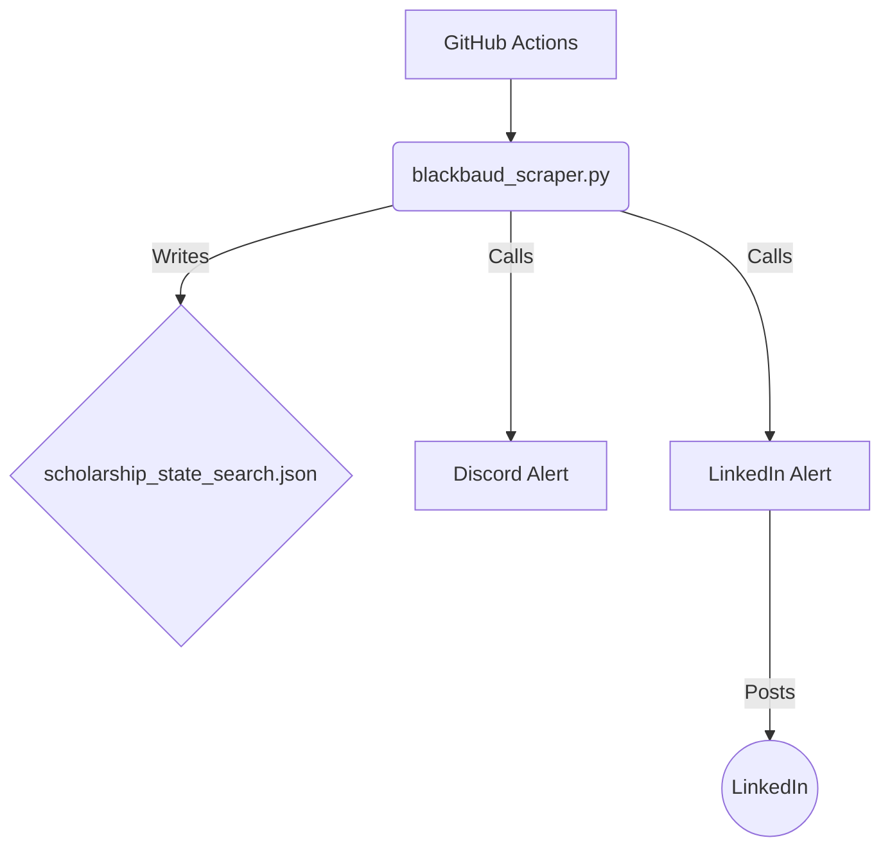

# 🛡️ Scholarship Sentinel 🛡️
[](https://github.com/corruptcache/scholarship-sentinel/actions/workflows/daily_sentinel.yml)
### Open Source Grant Intelligence

>"Financial aid isn't a scarcity problem; it's a visibility problem."

##### Scholarship Sentinel is an automated Open Source Intelligence (OSINT) architecture designed to democratize access to workforce development funding. By monitoring institutional databases 24/7, it eliminates the "information asymmetry" that keeps students in debt.

### Follow Me On [LinkedIn](https://www.linkedin.com/in/johnaknowles/) For Scholarship Updates!

## 🏗️ The Architecture



Most students check scholarship portals once a semester. This system runs a sentinel every morning.

This project uses a Serverless CI/CD Pipeline (GitHub Actions) to execute a specialized intelligence sweep:

* **The Sentinel:** Monitors the AcademicWorks portals for CPCC and UNCC. It uses behavioral analysis (timestamp tracking) to detect "Zombie Grants"—funds re-listed mid-semester that human observers miss.  
* **The Signal:** When new funding is detected, the system pipes a rich-text payload to a Discord Webhook (Real-time).  
* **The Community:** A secondary bot formats the intelligence into a LinkedIn update to inform the wider student body.

## 📂 File Structure

The repository is organized into the following directories:

*   `scrapers/`: Contains the scripts for scraping scholarship data.
*   `alerts/`: Contains the scripts for sending alerts to Discord and LinkedIn.
*   `tests/`: Contains test scripts for the scrapers and alerts.
*   `data/`: Stores the generated scholarship data (JSON and CSV).
*   `config/`: Contains configuration files for the scrapers.

## 🛠️ The Toolkit

This repository contains distinct modules for targeted intelligence gathering:

| Module | Target | Technique |
| :---- | :---- | :---- |
| `scrapers/blackbaud_scraper.py` | CPCC & UNCC | BeautifulSoup scraping of Blackbaud portals. Features Timezone-Adjusted Timestamping to track administrative schedules. |
| `alerts/linkedin_alert.py` | Social Signal | Automates community distribution via the LinkedIn UGC API. |

## 🧪 Testing & Integration

To verify connectivity and formatting without waiting for the daily cron job, use the included test scripts:

| Script | Purpose |
| :---- | :---- |
| `tests/test_discord_alert.py` | Unit tests for the Discord alert logic. |
| `tests/test_linkedin_alert.py` | Unit tests for the LinkedIn alert logic. |

## 🚀 Deployment

### **Option 1: The "Serverless" Method (Recommended)**

This project is optimized for GitHub Actions. You do not need a server.

1. **Fork this Repository.**  
2. **Configure Secrets:** Go to Settings \-> Secrets and variables \-> Actions and add:  
```env
   DISCORD_WEBHOOK_URL: Your Discord Webhook.  
   LINKEDIN_ACCESS_TOKEN: Your LinkedIn API access token.  
```
3. **Enable the Workflow:** Go to the "Actions" tab and enable the scan.  
4. **Done:** The bot will now run every morning at 08:00 UTC.

### **Option 2: Local Execution (Home Lab)**

To run this on your own machine (or Raspberry Pi):

1. Clone the repo
```bash
git clone https://github.com/corruptcache/scholarship-sentinel.git
```
2. Install Dependencies  
```bash
pip install -r requirements.txt
```
3. Set Environment Variables (.env file) 
```env
DISCORD_WEBHOOK_URL=https://discord.com/api/webhook
```
4. Run the Scanner  
```bash
python scrapers/blackbaud_scraper.py
```
## 📊 Sample Output

#### **The "New Grant" Alert (Discord)**

The bot detects a grant added at 4:45 PM on a Friday.

## 📈 Note on Quiet Periods

By default, `alerts/linkedin_alert.py` will stay quiet if no new scholarships are detected in the last 25 hours. This prevents "spamming" your network with empty updates. If you require a "Heartbeat" to ensure proper functionality, check the logs in GitHub Actions.

## ⚖️ Ethical Design

This tool is designed with Responsible Automation principles:

*   **Rate Limiting:** All scripts include time.sleep() delays to prevent server load.
    
*   **Passive Recon:** The GitHub Action runs only once per day, respecting standard robots.txt crawl frequencies.
    
*   **Spam Prevention:** The LinkedIn bot only posts when new data exists. It does not post "No Update" messages to social feeds.
    
*   **Public Benefit:** The data collected is not sold or gated. It is open-sourced to improve financial literacy for the student community.

## 📄 License

This project is open-source under the MIT License.  
Built for the Cyber Community. 2026\.
